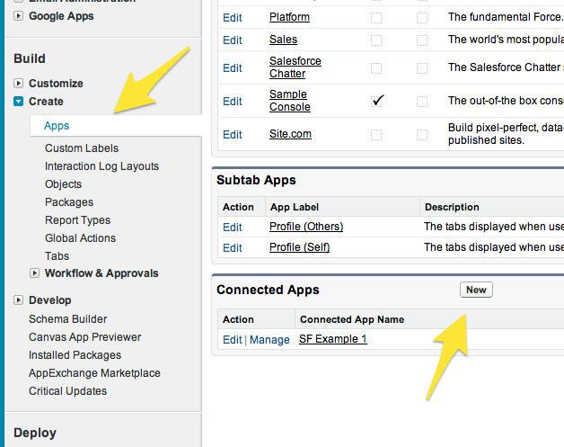
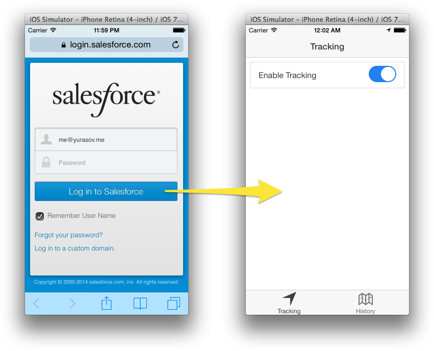
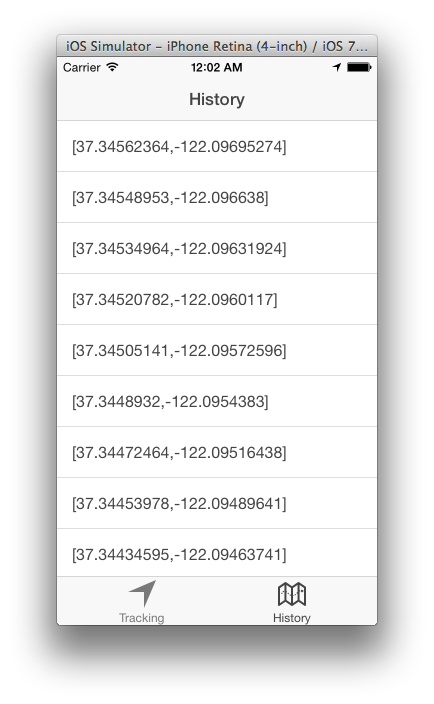

# Creating geo tracking app with Salesforce REST API and Ionic Framework


* Creating Salesforce Connected App
* Adding custom SObject
* Installing Ionic framework
* Creating Ionic app, installing required Cordova plugins
* Getting authentication token through OAuth2 flow
* Creating new "Position" object
* Starting geolocation and logging position to server
* Retrieving position history from server and displaying it

In this tutorial we will create an app using Ionic framework ([http://ionicframework.com](http://ionicframework.com)), AngularJS, Apache Cordova and Salesforce REST API.

First of all you need to create a Connected app on Force.com.

- Go to [https://developer.salesforce.com/](https://developer.salesforce.com/), sign up and navigate to your develope account.
- In the side menu choose Create > Apps and create new Connected App.
- Name it "SF Sample 1", enter your email and check "Enable OAuth Settings"
- Enter `sfsampleapp://oaut-callback` as your Callback URL.
- Add "Full access" to Selected OAuth Scopes
- Save Connected App

	

You may heve noticed we're using custom URL scheme for the callback. Our app is registerd in the system as the one that opens this type of URLs so we get a callback when user is done with the login process on the Salesforce web site.

We're going to use a custom object for storing location data in the Salesforce cloud. So we need to create one:

- Select _Create > Objects_ in the side menu
- Click "New Custom Object" button
- Enter "Position" as object label, "Positions" as plural label. "Position__c" will be automatically assigned as an API name for our object. We'll use this name for call to REST API.
- Leave other setting to default and hit Save

Now we need to install Ionic CLI tools. Since Ionic is built on top of Apache Cordova, we need to install it too. Assuming you already have nodejs and npm on your system, run the following commands in your terminal:

- Install Cordova and Ionic CLI: `npm install -g cordova ionic`
- Create a new tabbed app: `ionic start "SF Sample" tabs`
- Enter the created app directory: `cd SF\ Sample`

Go to [https://github.com/myurasov/Salesforce-REST-API-Ionic-framework-app-sample](https://github.com/myurasov/Salesforce-REST-API-Ionic-framework-app-sample) and copy all files from the repostory to the current folder.

App uses few of Cordova plugins:

- __LaunchMyApp__ for custom url scheme handling
- __org.apache.cordova.inappbrowser__ for opening OAuth URL in external browser
- __cordova-plugin-geolocation__ for location detection

Install them by executing the following commands:

	cordova plugin add https://github.com/EddyVerbruggen/LaunchMyApp-PhoneGap-Plugin.git --variable URL_SCHEME=sfsampleapp
	cordova plugin add org.apache.cordova.inappbrowser
	cordova plugin add https://git-wip-us.apache.org/repos/asf/cordova-plugin-geolocation.git
	
Edit __www/js/app.js__ and replace `---your-app-client-id---` with your Salesforce Connected App Client Id (can be seen in your Force.com developer account under _Create > Apps > SF Sample 1 > Manage_).
	
At this point you should be able to launch your app. Run the following commands to open app in the iOS emulator (iOS SDK should be installed to be able to do it):

	ionic platform add ios
	ionic build ios
	ionic emulate ios
	
You should see app loading and immideately opening Salesforce login page. After entering your login credentials and pressing "Log in to Salesforce" app is automatically opened ready to be used:
	
	
Let's dig into the code to see what's actually happening here.

First of all let's take a loot at __www/js/services.js__:

```
// auth service
app.factory('auth', function ($window, salesforce_client_id) {

  return {
    get: function () {
      var data = $window.localStorage.auth;
      console.log('auth.get', data);
      return data ? JSON.parse(data) : false;
    },

    set: function (data) {
      data = JSON.stringify(data);
      console.log('auth.set', data);
      $window.localStorage.auth = data;
    },

    erase: function () {
      delete $window.localStorage.auth;
    },

    // open OAuth page in external browser
    openLogin: function () {
      $window.open(
        'https://login.salesforce.com/services/oauth2/authorize' +
          '?response_type=token&display=touch' +
          '&redirect_uri=sfsampleapp://oauth-callback' +
          '&client_id=' + salesforce_client_id,
        '_system',
        'location=yes'
      )
    }
  }
});
```

We see the __auth__ service defined. It has methods to read/store/delete login information and `openLogin()` method which opens Salesforce login dialog optimized for smartphones.

Now knowing about what __auth__ service is we can understand the following piece of code in __www/js/app.js__:

```
  ...
  // check auth data
  .run(function ($ionicPlatform, auth) {
    $ionicPlatform.ready(function () {
      if (false === auth.get()) {
        auth.openLogin();
      }
    })
  })
  ...
  
```

It basically checks whether we have an auth token and if not – opens Salesforce login dialog. When user is done with login browser is redirected to `redirect_uri` parameter passed initially to Salesforce OAuth server. In our case it is `sfsampleapp://oauth-callback` – custom url scheme that our app is registered to handle. When app is invoked with this custom url scheme the global `handleOpenURL()` function is executed:

```
// handle custom url scheme
function handleOpenURL(url) {

  var path = url.match('://(.*?)[\\?#]')[1];

  if (path == 'oauth-callback') {

    // get hash part
    var query = url.substr(url.indexOf("#") + 1);

    var data = {};

    // split into parts
    var parts = query.split('&');

    // read names and values
    for (var i = 0; i < parts.length; i++) {
      var name = parts[i].substr(0, parts[i].indexOf('='));
      var val = parts[i].substr(parts[i].indexOf('=') + 1);
      val = decodeURIComponent(val);
      data[name] = val;
    }

    // save auth using LayoutController

    var $scope = angular.element(document.body).scope();

    $scope.$apply(function () {
      $scope.onAuth(data);
    });
  }
}
```

The actual URL received by this function looks like:

```
sfsampleapp://oauth-callback
#access_token=TOKEN
&instance_url=https%3A%2F%2Fna15.salesforce.com
&id=https%3A%2F%2Flogin.salesforce.com%2Fid%2F00Di0000000i7UjEAI%2F005i0000002Cy97AAC
&issued_at=1398573122814&signature=NDlJ9Gnz1of90yb1%2BvIgwPtl%2FQqEU31bJZ392LZeWf3D
&scope=full
&token_type=Bearer
```

Here are meaning of some passed params:

- __access_token__ - temporary token that serves for authorizing acces to Salesforce APIs
- __instance_url__ - API endpoint that should be used by our application
- __issued_at__ - Unix timestamp of the token creation date

Authentication params are parsed into JavaScript object and then using `$scope.$apply()` and __LoginController__ passed to __auth__ service to be saved.

Now when we have access token the rest is done with CRUD operations on a _Postion_ resource in __www/js/controlles.js__.

Creation of the new _Postion_ object with __POST__ method on collection:
	
```
$.ajax({
  url: authData.instance_url + '/services/data/v29.0/sobjects/Position__c',
  type: 'POST',
  headers: {
    'Authorization': authData.token_type + ' ' + authData.access_token,
    'Content-type': 'application/json'
  },
  data: JSON.stringify({'Data__c': ''}),
})
```

Update with __PATCH__ method on resource:

```
$.ajax({
  url: authData.instance_url + '/services/data/v29.0/sobjects/Position__c/' + $rootScope.positionObjectId,
  type: 'PATCH',
  headers: {
    'Authorization': authData.token_type + ' ' + authData.access_token,
    'Content-type': 'application/json'
  },
  data: JSON.stringify({'Data__c': JSON.stringify(positionList)}),
});
```

And finally we use __GET__ method to retrieve stored positions in __HistroryController__:


```
$.ajax({
  url: authData.instance_url + '/services/data/v29.0/sobjects/Position__c/' + $rootScope.positionObjectId,
  type: 'GET',
  headers: {
    'Authorization': authData.token_type + ' ' + authData.access_token,
    'Content-type': 'application/json'
  }
})
```



## Conclusion

We have created an app utilizing Salesforce in a flexible way without using any SDKs or libraries, but using only open standarts - OAuth protocol and RESTful APIs. The same approach can be easily ported to virtually any enviroment making it attractive in modern multi-platform enviroment.

## About the Author

I am a fullstack mobile/web/connected devices developer specializing in leading projects from the idea to the finished project. Feel free to contact me at <me@yurasov.me> for any comments and questions or visit my:

- [LinkedIn](https://www.linkedin.com/profile/view?id=173007295)
- [GitHub](https://github.com/myurasov)

Thank you for reading!